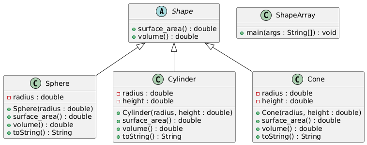
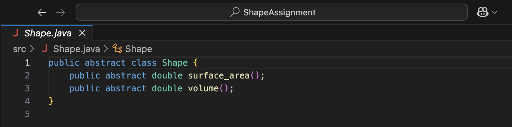
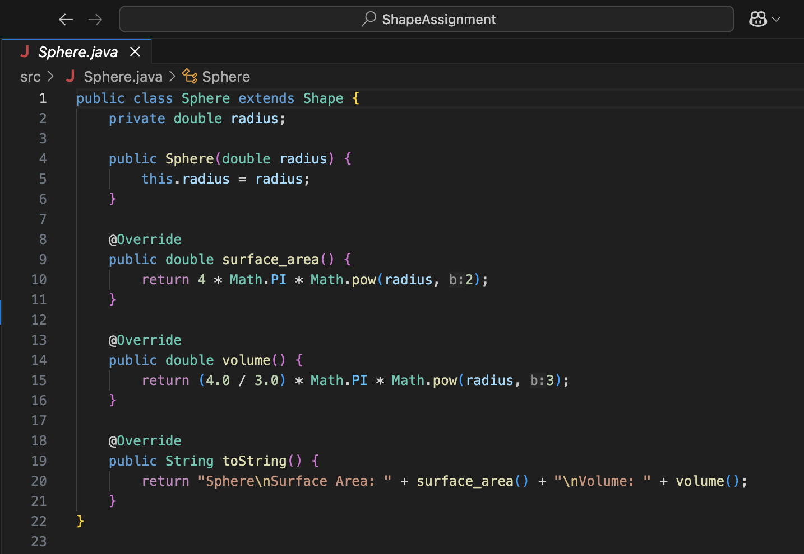
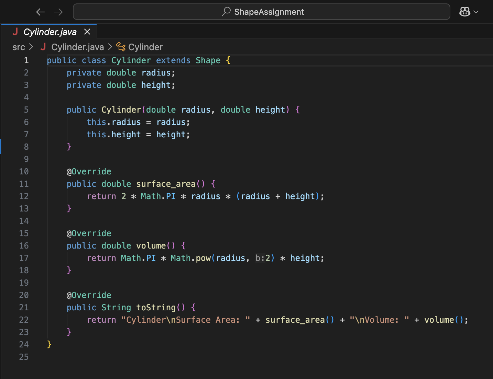
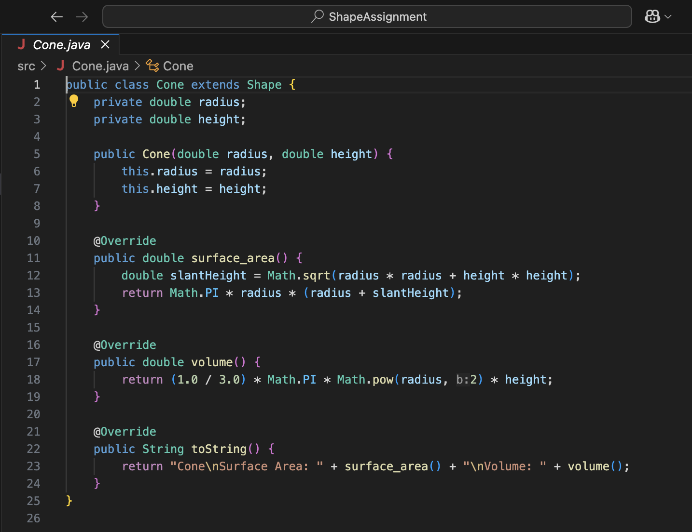
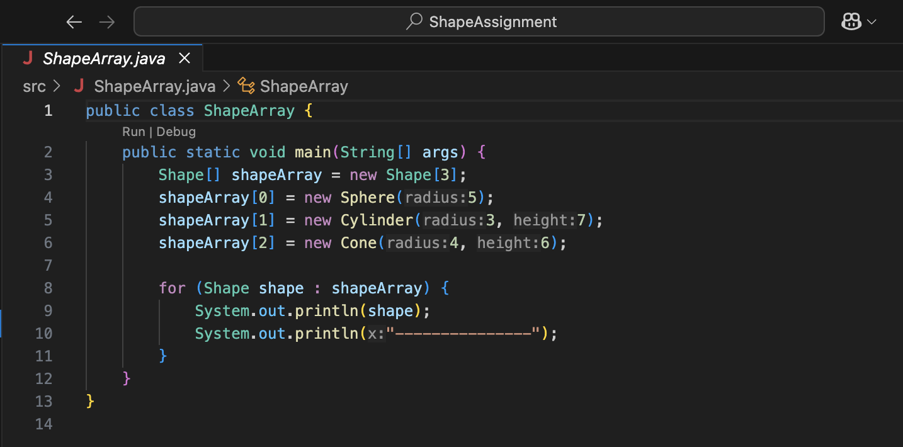
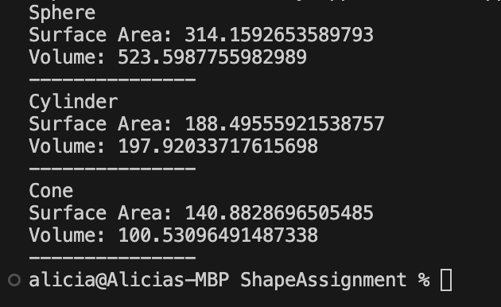

# Shape Assignment

This project demonstrates the use of abstract classes and inheritance in Java by implementing shapes: `Sphere`, `Cylinder`, and `Cone`.

---

##  UML Diagram

This UML diagram shows the class hierarchy and relationships among all components.

---

## 💻 Java Source Code

### `Shape.java`
Defines the abstract base class `Shape` with abstract methods `surface_area()` and `volume()`.

---

### `Sphere.java`
Extends `Shape` and overrides the surface area and volume calculations for a sphere.

---

### `Cylinder.java`
Extends `Shape` and implements the calculations for a cylinder.

---

### `Cone.java`
Extends `Shape` and implements the surface area and volume for a cone.

---

### `ShapeArray.java`
The **driver class**: creates instances of all shapes, stores them in an array, and prints their computed values.

---

##  Program Output

The following output is produced by running the `ShapeArray` class:

---

##  Version Control with GitHub

This project was built with proper version control using **Git** and hosted on **GitHub**.

[GitHub Repository](https://github.com/aliramirez08/ShapeAssignment)

---

## Technologies Used

- Java 17 / 22
- Visual Studio Code (Insiders Edition)
- UML Tools (Class diagrams)
- Git + GitHub

